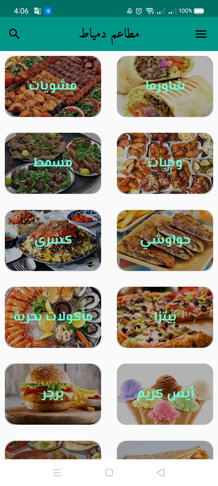
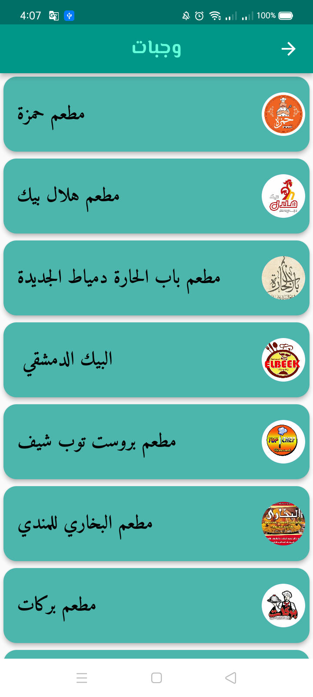
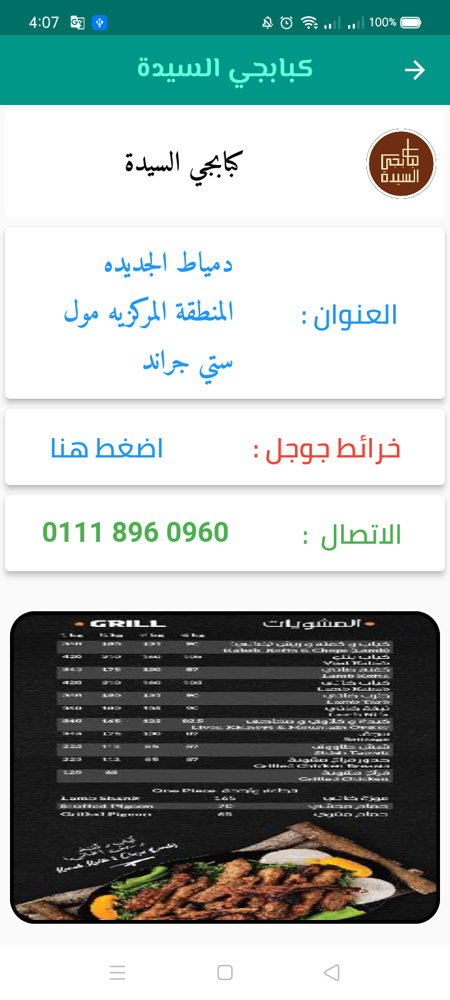
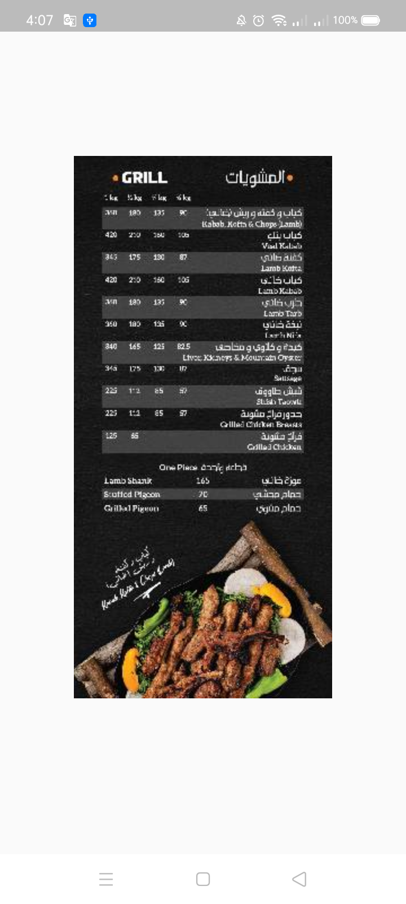
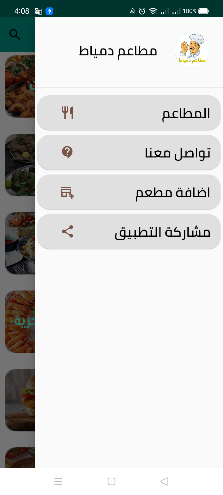
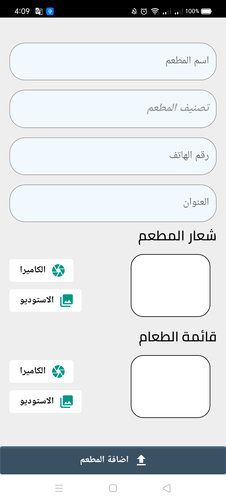

	

# تطبيق مطاعم دمياط Damietta Restaurants
	

	

 It includes most restaurants in one place, and the user can add any restaurant he wants 

	
# Package

## cached_network_image:  A flutter library to show images from the internet and keep them in the cache directory.

## cloud_firestore :

## firebase_storage: 

## firebase_core:

## flutter_offline: A tidy utility to handle offline/online connectivity like a Boss. It provides support for both iOS and Android platforms (offcourse).

## flutter_localizations : How to track the device’s locale (the user’s preferred language).

## google_fonts : The google_fonts package for Flutter allows you to easily use any of the thousands of fonts available from fonts.google.com in your Flutter app.

## image_cropper: A Flutter plugin for Android and iOS supports cropping images. This plugin is based on two different native libraries so it comes with different UI between these platforms.

## image_picker: A Flutter plugin for iOS and Android for picking images from the image library, and taking new pictures with the camera.

## map_launcher: Map Launcher is a flutter plugin to find available maps installed on a device and launch them with a marker or show directions.

## share_plus : A Flutter plugin to share content from your Flutter app via the platform's share dialog.

## url_launcher: A Flutter plugin for launching a URL. Supports iOS, Android, web, Windows, macOS, and Linux.

## uuid: 
